  

<h1 align="center">Hi 👋, I'am Rahul</h1>
<h3 align="center">Full Stack Developer</h3>

<!-- Tagline Center -->

  <strong>Crafting modern web applications with stunning UI and robust, scalable backend architecture. 🚀</strong>

<!-- GIF + Skills Side by Side -->
<table>
  <tr>
    <!-- Left: About + Skills -->
    <td width="60%" valign="top">
      <ul>
        <li>💻 I work with <strong>HTML, CSS, JavaScript, PHP, MySQL, MongoDB, React, Node.js & C++</strong></li>
        <li>🚀 Focused on <strong>Full Stack Development</strong></li>
        <li>🌐 Portfolio: <a href="https://rahul-shastri67.github.io/My-Portfolio/">https://rahul-shastri67.github.io/My-Portfolio/</a></li>
        <li>📫 Reach me at: <strong>shastrirahul246@gmail.com</strong></li>
      </ul>
    </td>

    <!-- Right: GIF -->
    <td width="40%" align="center" valign="middle">
      

    </td>
  </tr>
</table>

### 📊 GitHub Stats

  

  

---

### 🔥 Streak Stats

  

---

### 📌 Featured Projects

Here are some of my favorite projects 👇

- 🧾 **Portfolio Website** – HTML, CSS, JS based responsive portfolio  
- 🔐 **User Management System** – Authentication & authorization using PHP & MySQL  
- 📊 **Room Booking System** – Search, filters & booking flow

---

### 🤝 Connect With Me

  
  

---

<b>✨ Let's Code the Future — One Commit at a Time ✨</b>

